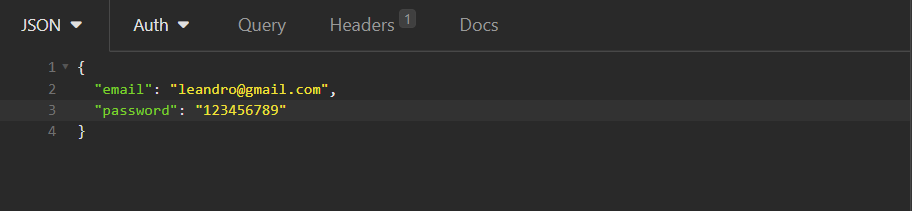
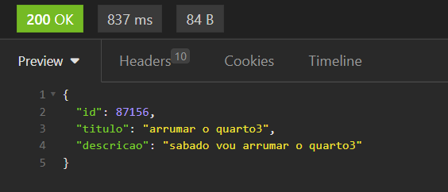

<h1>Apresentação Do Projeto</h1>

O projeto desenvolvido faz parte da avaliação de final de módulo de introdução ao backend do curso da Growdev de
    desenvolvimento web full stack. O objetivo era consolidar todos os conhecimentos aprendidos durante a formação do
    módulo.

    O objetivo do projeto consiste em desenvolver um backend para operações de CRUD (Create, Read, Update, Delete) de
    recados. Para isso, utilizou-se a linguagem de programação JavaScript juntamente com o ambiente Node.js. Além disso,
    foi empregado o framework Express para a construção de um servidor web eficiente e escalável.

<h2>Como Utilizar o Projeto</h2>

Após clonar o projeto do repositório, abra o terminal no Visual Studio Code e digite o comando "yarn" para baixar as
    dependências necessárias do projeto.

Para realizar as requisições através do Postman ou Insomnia, você pode utilizar a porta 3001 e acessar a rota
    "localhost:3001". Caso prefira, também é possível utilizar a seguinte URL:
    "https://avaliacao-back-and-crud-recados.onrender.com/".

Caso você tenha optado por clonar o projeto em sua máquina, abra o terminal no Visual Studio Code e digite o comando
    "yarn dev" para iniciar o servidor.

<h2>Rotas</h2>
<h3>Criar Usuário</h3>

Para acessar a aplicação, você precisa fazer uma requisição POST para criar um usuário. Utilize a rota "/signup". Por
    exemplo, se estiver usando o servidor local, a URL seria "localhost:3001/signup". Caso prefira utilizar a aplicação
    hospedada, a URL seria "https://avaliacao-back-and-crud-recados.onrender.com/signup".

    
exemplo: requisição pelo servidor local.

    

    
exemplo: requisição pela hospedagem.

    

 

    

        Para criar um usuário, você precisa fornecer o nome, e-mail
        e senha na requisição. Segue abaixo um exemplo de
        como preencher os dados:
    

    

    <h3>Login</h3>
    
 Para realizar o login, faça uma requisição POST utilizando a rota "/login". Seguem abaixo exemplos de URLs para
        acesso, considerando diferentes ambientes:

        - Localhost: "localhost:3001/login"
        - Hospedagem online: "https://avaliacao-back-and-crud-recados.onrender.com/login"

        Certifique-se de utilizar a URL correta de acordo com o ambiente em que está executando a aplicação.

    
Para acessar sua conta, é necessário fornecer o e-mail e a senha que foram usados ​​durante a criação da conta.
        Segue abaixo um exemplo de como preencher os dados na requisição:

    

 

    <h3>Ler Todos Os Usuários</h3>
    

        Para obter os usuários cadastrados, você pode fazer uma requisição GET para a rota "/signup". Seguem abaixo
        exemplos de URLs para acesso, considerando diferentes ambientes:

        - Localhost: "localhost:3001/signup"
        - Hospedagem online: "https://avaliacao-back-and-crud-recados.onrender.com/signup"

        Ao acessar essa rota, você receberá as informações dos usuários, como o ID, nome, senha criptografada e os
        recados associados. Certifique-se de fazer a requisição GET corretamente para visualizar esses dados.

    

 

    <h3>Criar Recados</h3>
    
Para criar um recado, faça uma requisição POST e utilize a rota "/recados/create/id-usuario". Substitua
        "id-usuario" pelo ID gerado na
        criação do usuário e siga os exemplos abaixo, considerando diferentes ambientes:

        - Localhost: "localhost:3001/recados/create/id-usuario"
        - Hospedagem online: "https://avaliacao-back-and-crud-recados.onrender.com/recados/create/id-usuario"

        Certifique-se de passar o ID do usuário como parâmetro na URL para associar corretamente o recado ao usuário
        correspondente.

    
exemplo de rota com o ID criado:

    

    
Para criar um recado, utilize a rota "/recados/create/id-usuario". Substitua "id-usuario" pelo ID gerado na
        criação do usuário e siga os exemplos abaixo, considerando diferentes ambientes:

        - Localhost: "localhost:3001/recados/create/id-usuario"
        - Hospedagem online: "https://avaliacao-back-and-crud-recados.onrender.com/recados/create/id-usuario"

        Certifique-se de passar o ID do usuário como parâmetro na URL para associar corretamente o recado ao usuário
        correspondente.

    
exemplo de rota com o ID criado

    

    
Para criar um recado, é necessário fornecer o título e a descrição do recado. Abaixo está um exemplo de como
        preencher os dados na requisição:

    

 

    

        Após fazer a requisição de criação do recado, a resposta retornará um objeto contendo o ID do recado, o título e
        a descrição. É importante anotar o ID do recado, pois você precisará dele para realizar outras requisições
        relacionadas a esse recado.
    

    
Exemplo da resposta:

    
    
Certifique-se de armazenar o ID do recado para usar em requisições futuras relacionadas a ele.

 

    <h3>Ler Todos os Recados</h3>
    

        Para ler todos os recados existentes, faça uma requisição GET para a rota "/recados/reade". Utilize os exemplos
        de URL abaixo, considerando diferentes ambientes:

        - Localhost: "localhost:3001/recados/reade"
        - Hospedagem online: "https://avaliacao-back-and-crud-recados.onrender.com/recados/reade"

        Ao fazer essa requisição, a resposta retornará todos os recados já criados. Verifique a resposta para obter as
        informações dos recados.

    
Exemplo:

    

 

    <h3>Ler Um Recado Por Id</h3>
    

        Para ler um único recado, faça uma requisição GET para a rota "/recados/readeID/id-recado/id-usuario".
        Certifique-se de passar o ID do recado que deseja visualizar, juntamente com o ID do usuário, como parâmetros na
        URL. Utilize os exemplos de URL abaixo, considerando diferentes ambientes:

        - Localhost: "localhost:3001/recados/readeID/id-recado/id-usuario"
        - Hospedagem online: "https://avaliacao-back-and-crud-recados.onrender.com/recados/readeID/id-recado/id-usuario"

    
Exemplo:

    

    
Ao fazer a requisição GET para ler um único recado, a resposta retornará um objeto que contém as informações do
        recado desejado.

    
Exemplo:

    

 

    <h3>Atualizar Recados</h3>
    

        Para atualizar um recado, faça uma requisição PUT para a rota "/recados/update/id-recado/id-usuario".
        Certifique-se de passar o ID do recado que deseja atualizar, juntamente com o ID do usuário, como parâmetros na
        URL. Utilize os exemplos de URL abaixo, considerando diferentes ambientes:

        - Localhost: "localhost:3001/recados/update/id-recado/id-usuario"
        - Hospedagem online: "https://avaliacao-back-and-crud-recados.onrender.com/recados/update/id-recado/id-usuario"

    
Exemplo:

    
     
    
Certifique-se de incluir os novos dados do recado no corpo da requisição, seguindo o exemplo a seguir.

    

 

    <h3>Deletar Recado</h3>
    

        Para deletar um recado, faça uma requisição DELETE para a rota "/recados/delete/id-recado/id-usuario".
        Certifique-se de passar o ID do recado que deseja deletar, juntamente com o ID do usuário, como parâmetros na
        URL. Utilize os exemplos de URL abaixo, considerando diferentes ambientes:

        - Localhost: "localhost:3001/recados/delete/id-recado/id-usuario"
        - Hospedagem online: "https://avaliacao-back-and-crud-recados.onrender.com/recados/delete/id-recado/id-usuario"

        Ao fazer essa requisição, o recado correspondente ao ID informado será deletado. Verifique a resposta da
        requisição para confirmar se o recado foi deletado com sucesso.

    
Exemplo Rota:

    

    <h2>Obrigado Espero Que Gostem!</h2>

