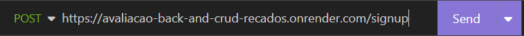

<h1>Apresentação do projeto</h1>

O projeto desenvolvido faz parte da avaliação de final de módulo de introdução ao backend do curso da Growdev de
    desenvolvimento web full stack. O objetivo era consolidar todos os conhecimentos aprendidos durante a formação do
    módulo.

    O objetivo do projeto consiste em desenvolver um backend para operações de CRUD (Create, Read, Update, Delete) de
    recados. Para isso, utilizou-se a linguagem de programação JavaScript juntamente com o ambiente Node.js. Além disso,
    foi empregado o framework Express para a construção de um servidor web eficiente e escalável.

<h2>Como utilizar o projeto</h2>

Após clonar o projeto do repositório, abra o terminal no Visual Studio Code e digite o comando "yarn" para baixar as
dependências necessárias do projeto.

Para realizar as requisições através do Postman ou Insomnia, você pode utilizar a porta 3001 e acessar a rota
    "localhost:3001". Caso prefira, também é possível utilizar a seguinte URL:
    "https://avaliacao-back-and-crud-recados.onrender.com/".

Caso você tenha optado por clonar o projeto em sua máquina, abra o terminal no Visual Studio Code e digite o comando
    "yarn dev" para iniciar o servidor.

>

<h3>Rotas</h3>

Para acessar a aplicação, você precisa fazer uma requisição POST para criar um usuário. Utilize a rota "/signup". Por
exemplo, se estiver usando o servidor local, a URL seria "localhost:3001/signup". Caso prefira utilizar a aplicação
hospedada, a URL seria "https://avaliacao-back-and-crud-recados.onrender.com/signup".

    
exemplo: requisição pelo servidor local.

    

    
exemplo: requisição pela hospedagem.

    

 

    

        Para criar um usuário, você precisa fornecer o nome, e-mail 
        e senha na requisição. Segue abaixo um exemplo de
        como preencher os dados:
    

    

    
        Para realizar o login, faça uma requisição POST utilizando a rota "/login". Seguem abaixo exemplos de URLs para
        acesso, considerando diferentes ambientes:

        - Localhost: "localhost:3001/login"
        - Hospedagem online: "https://avaliacao-back-and-crud-recados.onrender.com/login"

        Certifique-se de utilizar a URL correta de acordo com o ambiente em que está executando a aplicação. 

 
Para acessar sua conta, é necessário fornecer o e-mail e a senha que foram usados ​​durante a criação da conta. Segue abaixo um exemplo de como preencher os dados na requisição:

 

